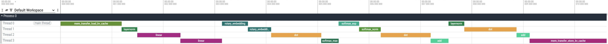
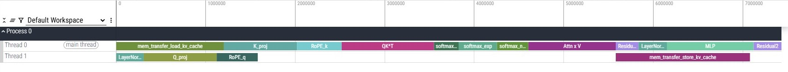
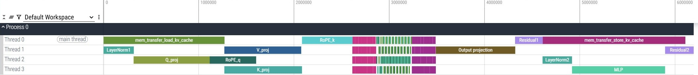
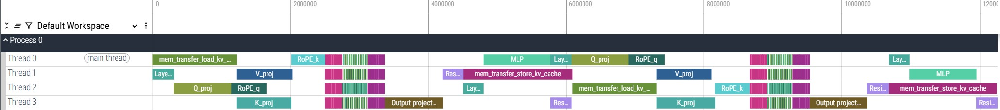
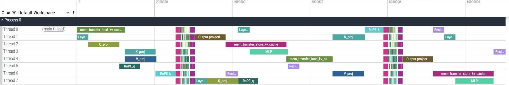

# Compute_visualizing (Inferencing Scheduling)

**Purpose**: Visualizing LLAMA3.2 Compute Chain

**Compute Operations**: dot product, 3-pass softmax, normalization, positional encoding, memory transfers

**Settings**: 
* [LLAMA-3.2-1B model](https://huggingface.co/meta-llama/Llama-3.2-1B) from HuggingFace
* Auto regressive decoding
* One transformer block
* [Perfetto](https://ui.perfetto.dev/) trace for visualization
* Dynamically adapts to changes
  
**Relative parameters**:
* Query matrix $Q$: shape $(1, D)$
* Cached key matrix $K$: shape $(N, D)$
* Cached value matrix $V$: shape $(N, D)$
* Dimensions $N=4$ (KV size / past tokens) and $D=2048$ ~~D=16~~ (hidden dimension per token)
* 4 concurrent compute engines
* Profiler has estimated duration time only (see below Additional Information for more details)

**Results**:
* Without parallelism

<br/>

* With parallelism

<br/>

* Multi-head parallelism 


  Zoom in to scattered part (Multi-head Attention)

<br/>

* Multi-head parallelism with 2 tokens

  mem_load_kv (memory load) of the 2nd token executed right after mem_store_kv (write-back) of the 1st token;
  LayerNorm (the very first procedure) of the 2nd token was executed earlier and processed with token 1 in parallel 
<br/>

* Multi-head parallelism with 2 tokens (test with 8 threads)

  mem_load_kv (memory load) of the 2nd token executed right after mem_store_kv (write-back) of the 1st token;
  LayerNorm, Q_proj, and RoPE_q (the very first procedures) of the 2nd token were processed very early (in the middle of token 1 procedure) since threads availability 
<br/>


# Project Structure
```bash
project-root/
├── README.md                         # Project overview
├── src/                
│   ├── transformer_block_tracer.py   # Main function
│   ├── llama_loader.py               # Model import
│   ├── scheduler.py                  # Scheduling tasks (in processing)
│   └── perfetto_writer.py            # Write JSON for Perfetto 
│       └── profiler.py               # Profiles for writer
└── output/
    ├── llama_model_structure.txt     # Impoted Model dump
    └── transformer_trace.json        # JSON file to Perfetto
```

<br/>

**Additional Information**: 
* Customerized attention block in order to display 3-pass softmax (max-subtraction, exponentiation, normalization)
* Modified structure in layer #3 projection and #4 RoPE for tensor dimension matched and Rorate Positional Encoding implementation. Model behavior may be slightly different because the project is for processing load simulating and scheduling only
* Profiler has estimated duration time only: If real durations are needed, has to run forward pass on oringal Llama model with torch.profile() tool, log real execution time, and skip function call to estimate_duration() in profiler.py for each operations
* Multi-head processing were implemented to run in parallel. Each duration is just roughly divided total duration by the head_number.

**To-do Items**:
1. Well adjust scheduling with other algorithms
2. Profile(duration) update should be accommodated to real execution environment 
   (maybe perform a forward pass with torch.profile() on original model → update parameters in profiler.py/directly edit default values of logging)

<br/>

**References**:
1. [Exploring and building the LLaMA 3 Architecture : A Deep Dive into Components, Coding, and Inference Techniques](https://medium.com/@vi.ai_/exploring-and-building-the-llama-3-architecture-a-deep-dive-into-components-coding-and-43d4097cfbbb)
2. [LLM Optimization and Deployment on SiFive RISC-V Intelligence Products](https://www.sifive.com/blog/llm-optimization-and-deployment-on-sifive-intellig)
3. ChatGPT
